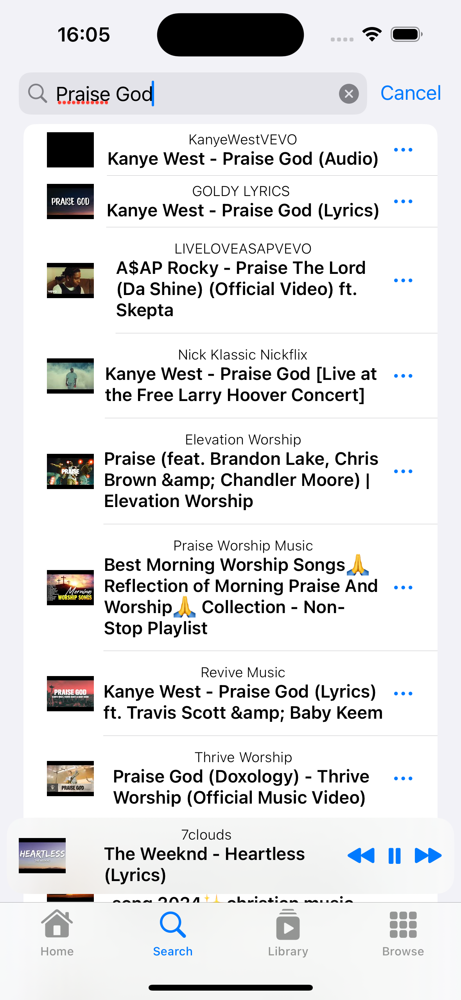
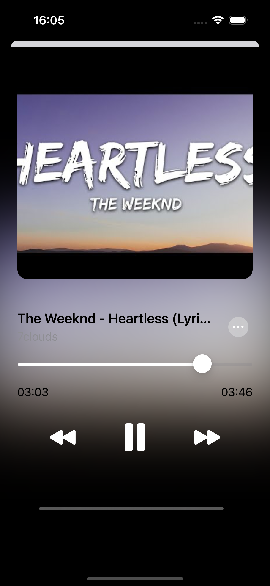
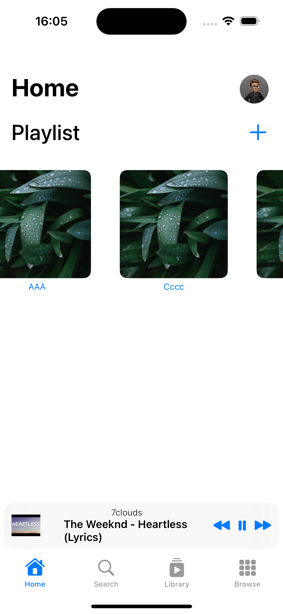

# Music Player App (iOS)

## Overview

This is a simple music player app designed for iOS devices. The app was created using the YouTube API to fetch music and stream it to users via my own server. The goal was to provide an App which can stream music without paying for it.
## Features

- **Stream Music:** Fetches music from YouTube using the YouTube API.
- **Custom Server:** Streams the music through a custom server.
- **User-Friendly Interface:** Designed with simplicity in mind for an effortless music experience. (Inspiration from Apple Music, see Screenshots)

## Discontinuation

Unfortunately, this project has been discontinued. The decision was made due to performance issues that arose during use. The app became increasingly laggy, primarily because of limitations related to the YouTube API. Despite efforts to optimize, these issues could not be fully resolved, leading to the discontinuation of the app.

## Future Plans

There are no current plans to continue development on this project. However, lessons learned from this project will be applied to future endeavors, particularly concerning API integration and app performance.

---

## Screenshots

  
  
  

